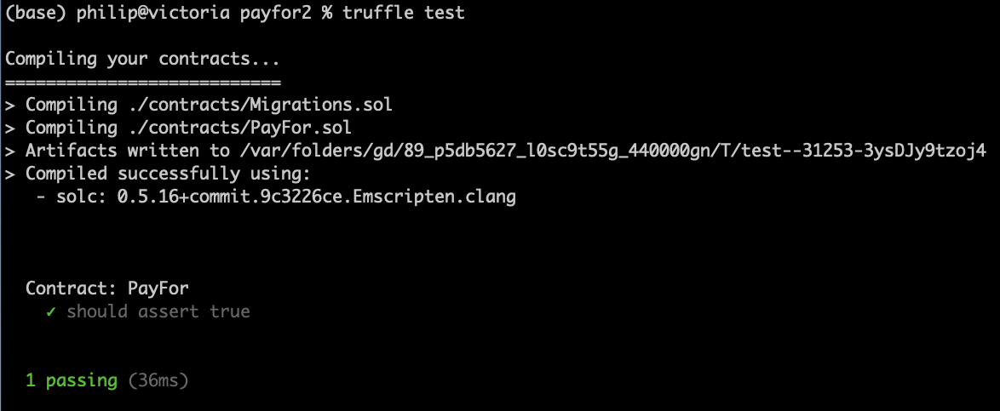

<style>
.pagebreak { page-break-before: always; }
.half { height: 200px; }
</style>
<style>
.pagebreak { page-break-before: always; }
.half { height: 200px; }
.markdown-body {
	font-size: 12px;
}
.markdown-body td {
	font-size: 12px;
}
</style>


Lecture 15 - Creating a 1st contract
==

## Setting up a new project

```
$ mkdir payfor2
$ cd payfor2
$ truffle init 
```

Scaffold commands to start with

```
$ truffle create contract PayFor 
$ truffle create test PayFor    
```


You can now build the empty contract and test it.

In a 2nd window start ganache-cli

```
$ ganache-cli
```

Edit truffle-config.js - to connect to ganache.  Around line 74

```
74:    development: {
75:      host: "127.0.0.1", 
76:      port: 8545,       
77:      network_id: "*", 
78:    },
```

add a "migration" file in the ./migrations/ directory
create `2_initial_migrations.js` with:

```
const PayFor = artifacts.require("PayFor");

module.exports = function(deployer) {
  deployer.deploy(PayFor);
};
```

Now Compile and load the contract:


```
$ truffle comile
$ truffle migrate
```

Save the output from the migrate - it is important!

and... Run the empty test

```
$ truffle test
```

It procures a cute output:



