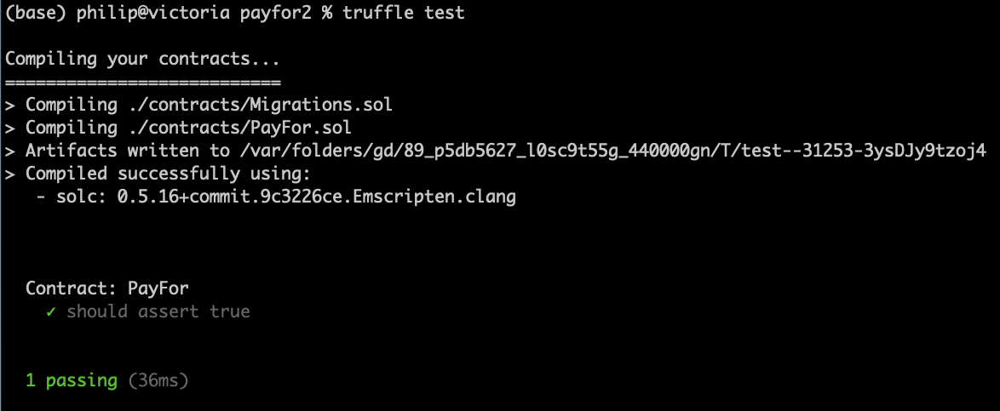

<style>
.pagebreak { page-break-before: always; }
.half { height: 200px; }
</style>
<style>
.pagebreak { page-break-before: always; }
.half { height: 200px; }
.markdown-body {
	font-size: 12px;
}
.markdown-body td {
	font-size: 12px;
}
</style>


Lecture 15 - Creating a 1st contract
==

## Setting up a new project

```
$ mkdir payfor2
$ cd payfor2
$ truffle init 
```

Scaffold commands to start with

```
$ truffle create contract PayFor 
$ truffle create test PayFor    
```


You can now build the empty contract and test it.

In a 2nd window start ganache-cli

```
$ ganache-cli
```

Edit truffle-config.js - to connect to ganache.  Around line 74

```
74:    development: {
75:      host: "127.0.0.1", 
76:      port: 8545,       
77:      network_id: "*", 
78:    },
```

add a "migration" file in the ./migrations/ directory
create `2_initial_migrations.js` with:

```
const PayFor = artifacts.require("PayFor");

module.exports = function(deployer) {
  deployer.deploy(PayFor);
};
```

Now Compile and load the contract:


```
$ truffle comile
$ truffle migrate
```

Save the output from the migrate - it is important!

and... Run the empty test

```
$ truffle test
```

It procures a cute output:




To reload a contract you need a "truffle migrate --reset".

```
(base) philip@victoria payfor % truffle migrate --reset

Compiling your contracts...
===========================
> Everything is up to date, there is nothing to compile.


Starting migrations...
======================
> Network name:    'development'
> Network id:      1645743739818
> Block gas limit: 6721975 (0x6691b7)


1_initial_migration.js
======================

   Replacing 'Migrations'
   ----------------------
   > transaction hash:    0xc2215471f6e946eb1990156ccd5367b81f540f5d4b775fdf7aa2fda6d3161330
   > Blocks: 0            Seconds: 0
   > contract address:    0x3b6bdDFC0A92E3BDa4dd4941D5319b40227cdE21
   > block number:        31
   > block timestamp:     1645795766
   > account:             0x5C046b3B982a2073584613213e40C22d6A876300
   > balance:             99.89637302
   > gas used:            191943 (0x2edc7)
   > gas price:           20 gwei
   > value sent:          0 ETH
   > total cost:          0.00383886 ETH


   > Saving migration to chain.
   > Saving artifacts
   -------------------------------------
   > Total cost:          0.00383886 ETH


2_initial_migrations.js
=======================

   Replacing 'PayFor'
   ------------------
   > transaction hash:    0x768be0029d0a020c861bb22ffe7dd0efab40eb1f3a4a96f8d4191f70638c3f59
   > Blocks: 0            Seconds: 0
   > contract address:    0x921511c8972EA1e3c4A9Acf117714917eB3f6a15
   > block number:        33
   > block timestamp:     1645795766
   > account:             0x5C046b3B982a2073584613213e40C22d6A876300
   > balance:             99.8828177
   > gas used:            635428 (0x9b224)
   > gas price:           20 gwei
   > value sent:          0 ETH
   > total cost:          0.01270856 ETH


   > Saving migration to chain.
   > Saving artifacts
   -------------------------------------
   > Total cost:          0.01270856 ETH


Summary
=======
> Total deployments:   2
> Final cost:          0.01654742 ETH

```


<div class="pagebreak"></div>

## Take a look at the contract code.

```
  1: // SPDX-License-Identifier: MIT
  2: pragma solidity >=0.4.22 <0.9.0;
  3: 
  4: contract PayFor {
  5: 
  6:     struct productPriceStruct {
  7:         uint256 price;
  8:         bool isValue;
  9:     }
 10:     struct paymentsStruct {
 11:         address listOfPayedBy;
 12:         uint256 listOfPayments;
 13:         uint256 payFor;
 14:     }
 15: 
 16:     address payable owner_address;
 17:     event ReceivedFunds(address sender, uint256 value, uint256 application, uint256 loc);
 18:     event Withdrawn(address to, uint256 amount);
 19:     event SetProductPrice ( uint256 product, uint256 minPrice );
 20:     event LogDepositReceived(address sender);
 21: 
 22:     paymentsStruct[] private paymentsFor;
 23:     mapping (uint256 => productPriceStruct) internal productMinPrice;
 24: 
 25:     constructor() public {
 26:         owner_address = msg.sender;
 27:     }
 28: 
 29:     /**
 30:      * @return the address of the owner.
 31:      */
 32:     function owner() public view returns (address) {
 33:         return owner_address;
 34:     }
 35: 
 36:     /**
 37:      * @dev Throws if called by any account other than the owner.
 38:      */
 39:     modifier onlyOwner() {
 40:         require(isOwner());
 41:         _;
 42:     }
 43: 
 44:     /**
 45:      * @return true if `msg.sender` is the owner of the contract.
 46:      */
 47:     function isOwner() public view returns (bool) {
 48:         return msg.sender == owner_address;
 49:     }
 50: 
 51:     /**
 52:      * @dev set the minimum price for a product.  Emit SetProductPrice when a price is set.
 53:      */
 54:     function setProductPrice(uint256 productNumber, uint256 minPrice) public onlyOwner {
 55:         productMinPrice[productNumber] = productPriceStruct ( minPrice, true );
 56:         emit SetProductPrice ( productNumber, minPrice );
 57:     }
 58: 
 59:     /**
 60:      * @return true for funds received.  Emit a ReceivedFunds event.
 61:      */
 62:     function receiveFunds(uint256 forProduct) public payable returns(bool) {
 63:         // Check that product is valid
 64:         require(productMinPrice[forProduct].isValue, 'Invalid product');
 65:         // Validate that the sender has payed for the prouct.
 66:         require(productMinPrice[forProduct].price <= msg.value, 'Insufficient funds for product');
 67: 
 68:         uint256 pos;
 69:         pos = paymentsFor.length;
 70:         paymentsFor.push ( paymentsStruct ( msg.sender, msg.value, forProduct ) );
 71:         emit ReceivedFunds(msg.sender, msg.value, forProduct, pos);
 72:         return true;
 73:     }
 74: 
 75:     /**
 76:      * @return the number of paymetns.
 77:      */
 78:     function getNPayments() public onlyOwner view returns(uint256) {
 79:         return ( paymentsFor.length );
 80:     }
 81: 
 82:     /**
 83:      * @return the address that payeed with the payment amount and what was payed for.
 84:      */
 85:     function getPaymentInfo(uint256 n) public onlyOwner view returns(address, uint256, uint256) {
 86:         return ( paymentsFor[n].listOfPayedBy, paymentsFor[n].listOfPayments, paymentsFor[n].payFor );
 87:     }
 88:     
 89:     /**
 90:      * @dev widthdraw funds form the contract.
 91:      */
 92:     function withdraw( uint256 amount ) public onlyOwner returns(bool) {
 93:         require(address(this).balance >= amount, "Insufficient Balance for withdrawl");
 94:         address(owner_address).transfer(amount);
 95:         emit Withdrawn(owner_address, amount);
 96:         return true;
 97:     }
 98: 
 99:     /**
100:      * @return the amount of funds that can be withdrawn.
101:      */
102:     function getBalanceContract() public view onlyOwner returns(uint256){
103:         return address(this).balance;
104:     }
105: 
106:     /**
107:      * @return Catch and save funds for abstrc transfer.
108:      */
109:     function() external payable {
110:         require(msg.data.length == 0);
111:         emit LogDepositReceived(msg.sender);
112:     }
113: 
114: }

```
