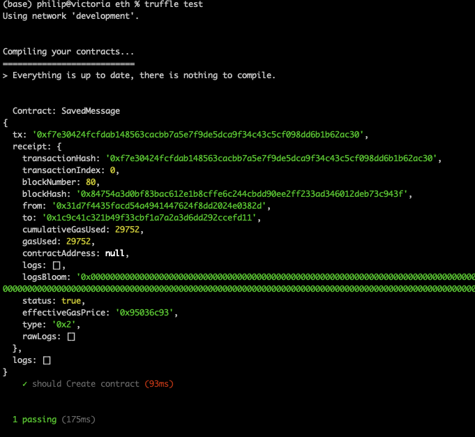

m4_include(../../../setup.m4)

# Lecture 23 - web3.js client example


To setup MetaMask to work with truffle:
[https://trufflesuite.com/docs/truffle/getting-started/truffle-with-metamask](https://trufflesuite.com/docs/truffle/getting-started/truffle-with-metamask)


The Truffle PetShop Tutorial:
[https://trufflesuite.com/guides/pet-shop/](https://trufflesuite.com/guides/pet-shop/)


## Steps

1. Setting up the development environment ( you should be able to write, build, compile a contact at this point )
2. Writing the smart contract 
4. Compiling and migrating the smart contract
5. Testing the smart contract
6. Creating a user interface to interact with the smart contract
5. Running a "server"
7. Interacting with the dApp in a browser


## Setting up the development environment 

Use git to clone this repository `./eth`.
If you move this to a different path then `cd eth ; rm -rf build` to get rid of the 
old build (it has paths in it that are now wrong).   Then recompile to build again.

```
$ truffle compile
```

Use truffle to pull out a pre-built environment like the pet-shop.

Remember to run ganache with the web-sockets turned on.

```
$ ganache  --server.ws 
```

Check MetaMask configuration to get it to talk to gouache 
ganache at

```
RPC Listening on 127.0.0.1:8545
```

Save the list of accounts - we may need that later and it is unique 
each time you run ganache

```
Available Accounts
==================
(0) 0x31D7f4435fAcd54A4941447624f8Dd2024e0382D (1000 ETH)
(1) 0x97FCbbFa2B46d7e8f572864E917d91B9FaA53a71 (1000 ETH)
(2) 0xEF712f61EA21d683d9eA4b11f927B24cDB373F74 (1000 ETH)
(3) 0x9d934D43B20607ce1B5096D21fb7C6C1F9d50b56 (1000 ETH)
(4) 0x79668fF2E8e12570B96E342Ac1362B3a3bF6eE47 (1000 ETH)
(5) 0xa82998A94C94132a154a2Ce1a5A49F587648Db7a (1000 ETH)
(6) 0xe34fA6f30f22F87639055FEa72653Fb4785263e0 (1000 ETH)
(7) 0x27CbED781f167fCDe94BE5578F4d801c0F7E83B6 (1000 ETH)
(8) 0x1F54130FB40E97FD49c9cEF928958494Da20A030 (1000 ETH)
(9) 0x6827Db0342cd1EC78D12735dFE5898bf9685d262 (1000 ETH)

Private Keys
==================
(0) 0xb3128b28ab6963f34170ddafa2cf820e160110c0ef4f0c8b70b6e71f40199566
(1) 0x3afce7e5e265fceee780167905da8b0b9e398a93cbd978f129a504f0874dbf95
(2) 0xdcd7fb4f680e1b0220024fe381cd8685a496e59bafab894c02212e8faf7dd54f
(3) 0xd1005931c634c4758b8f64f7b706243978c12b065b0cf0c0e6d8591ec75e3404
(4) 0x6ff4eb43bb56a6b2ec91630870781c009e1d2857db7af1e1a167ca57972f04b8
(5) 0x09d2f7a43e1a55c307cf2d16decf0ddb3bfd0159c8ef6b0abd31c88aea85fb03
(6) 0x7b0768ba75b9fbc95330befd30b8a8c11fec71fee6d2bb97c13636c984f92978
(7) 0xf4f6088707b1b2376b60e545c4b6f01452a5a2c58ce7111bd3345f9db3edbb2e
(8) 0x6483311ee5caef63d8a5004ff20d459b4e1d8a3ce4b95753de04d9cf6e780e1e
(9) 0xbb0e78a03ae7db784cf544b7d72d25f71d7a8bdbc51600737f05fbc1df9ae48f
```

Remember that you have to load your contracts every time you start
ganache.

```
$ truffle migrate --reset
```

Save the output from the migrate (Look at `migrate/3_saved_message.js`

```
3_saved_message.js
==================

   Replacing 'SavedMessage'
   ------------------------
   > transaction hash:    0x6f9415fed8259623c80ca000ddba00d8ea0db003aa3a8dcfb98106b928910dec
   > Blocks: 0            Seconds: 0
   > contract address:    0xD0C9933ed2f7022177E4fa572F3Ce7DFb0f2B8C7
   > block number:        85
   > block timestamp:     1647633386
   > account:             0x31D7f4435fAcd54A4941447624f8Dd2024e0382D
   > balance:             999.924376116511205725
   > gas used:            320309 (0x4e335)
   > gas price:           2.500015457 gwei
   > value sent:          0 ETH
   > total cost:          0.000800777451016213 ETH

   > Saving migration to chain.
   > Saving artifacts
   -------------------------------------
   > Total cost:     0.000800777451016213 ETH

```

File: migrations/3_saved_message.js:

```
m4_include(migrations/3_saved_message.js.nu)
```


## Writing the smart contract 

Write your new smart contract.  In this case we are going to use a Hello World contract.

```
m4_include(eth/contracts/SavedMessage.sol.nu)
```


## Compiling and migrating the smart contract

Check that your migration file is correct for any new contracts. 
The stuff in the `./migrations` directory is run by sorted order, hence the 1_, 2_ etc.

```
$ truffle migrate --reset
```

## Testing the smart contract


```
$ truffle test
```

output:



You _have to copy the files from ./build/contract into ../client/contract_.  This is in the Makefile.

##  Creating a user interface to interact with the smart contract

2 Files on the client side:

```
m4_include(client/index.html)
```

and

The file that all the work happens in:

```
m4_include(client/src/app.js.nu)
```

## Running a "server"

```
$ npm run start
```

or with a Go server

```
$ cd simple-go-server
$ go build
$ cd ../client
$ ./simple-server/simple-go-server --dir . --port 3004
```

## Interacting with the dApp in a browser

Demo...


