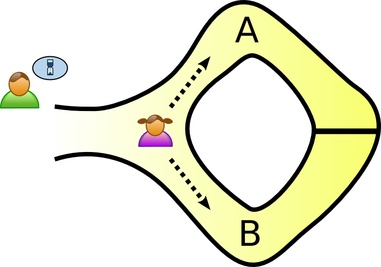
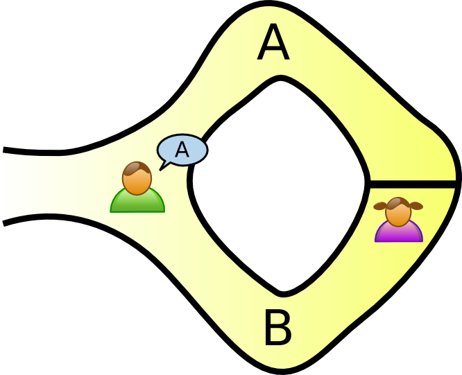

# Lecture 26 - Zero Knowledge Proofs

m4_include(../../../setup.m4)

# Videos

[https://youtu.be/ATJ0Xizm2OU - Lect-23-4010-5010-zk-SNark-pt1.mp4](https://youtu.be/ATJ0Xizm2OU)<br>
[https://youtu.be/KcktZj2BvHo - Lect-23-4010-5010-pt2.mp4](https://youtu.be/KcktZj2BvHo)<br>
[https://youtu.be/0b6cZr8woQM - Lect-23-4010-5010-pt3.mp4](https://youtu.be/0b6cZr8woQM)<br>
[https://youtu.be/Y8fpxQA4JrY - Lect-23-4010-5010-pt4.mp4](https://youtu.be/Y8fpxQA4JrY)<br>

From Amazon S3 - for download (same as youtube videos)

[http://uw-s20-2015.s3.amazonaws.com/Lect-23-4010-5010-zk-SNark-pt1.mp4](http://uw-s20-2015.s3.amazonaws.com/Lect-23-4010-5010-zk-SNark-pt1.mp4)<br>
[http://uw-s20-2015.s3.amazonaws.com/Lect-23-4010-5010-pt2.mp4](http://uw-s20-2015.s3.amazonaws.com/Lect-23-4010-5010-pt2.mp4)<br>
[http://uw-s20-2015.s3.amazonaws.com/Lect-23-4010-5010-pt3.mp4](http://uw-s20-2015.s3.amazonaws.com/Lect-23-4010-5010-pt3.mp4)<br>
[http://uw-s20-2015.s3.amazonaws.com/Lect-23-4010-5010-pt4.mp4](http://uw-s20-2015.s3.amazonaws.com/Lect-23-4010-5010-pt4.mp4)<br>

News
==

1. 80% Success in getting past fingerprint readers:
[https://arstechnica.com/information-technology/2020/04/attackers-can-bypass-fingerprint-authentication-with-an-80-success-rate/](https://arstechnica.com/information-technology/2020/04/attackers-can-bypass-fingerprint-authentication-with-an-80-success-rate/)

2. Fake fingerprints can unlock a smartphone.
[https://motherboard.vice.com/en_us/article/bjenyd/researchers-created-fake-master-fingerprints-to-unlock-smartphones](https://motherboard.vice.com/en_us/article/bjenyd/researchers-created-fake-master-fingerprints-to-unlock-smartphones)

3. Ethereum Network tokens used for COVID-19 Tracking.  Two different groups are using tokens for setting up "contact-tracing" on
smart phones using ETH smart contracts.
[https://futureloop.com/a/Op3bBypYGQ/](https://futureloop.com/a/Op3bBypYGQ/)

4. The GPUs in the ETH network (6000+ systems) have joint the Fold@Home network -the larges super computing network to find a cure
for the novel conronavirus.


zk-SNARKs
====

0. The acronym zk-SNARK stands for “Zero-Knowledge Succinct Non-Interactive Argument of Knowledge,” and refers to a
proof construction where one can prove possession of certain information, e.g. a secret key, without revealing that
information, and without any interaction between the prover and verifier. 
1. What is it - cave
2. Overview of how it will all work

Steps in a General Purpose zk-SNARK:

	1. Computation
	2. Algebraic Circuit
	3. Rank 1 Constraint System (R1CS)
	4. Quadratic Arithmetic Program (QAP)
	5. Linear PCP: provers are restricted to computing linear (or affine) functions of messages over some finite field or ring.
	6. Linear Interactive Proof
	7. zk-SNARK

## Reading

This web article walks through the Suduko example and also has the math-and walk through for authentication using a zk-SNARK:
[https://blockgeeks.com/guides/what-is-zksnarks/](https://blockgeeks.com/guides/what-is-zksnarks/)  The Schnorr Identification
protocall is at the hart of SRP6a - the system used for proof of identity in SSH.

Note: zk-SNARKs are different thatn zk-STARKs -  Please read all 3 parts:

1. [https://cryptodigestnews.com/digital-identity-privacy-and-zero-knowledge-proofs-zk-snarks-3d092b509990](https://cryptodigestnews.com/digital-identity-privacy-and-zero-knowledge-proofs-zk-snarks-3d092b509990)
2. [https://medium.com/coinmonks/zk-snarks-a-realistic-zero-knowledge-example-and-deep-dive-c5e6eaa7131c](https://medium.com/coinmonks/zk-snarks-a-realistic-zero-knowledge-example-and-deep-dive-c5e6eaa7131c)
3. [https://medium.com/coinmonks/zk-starks-create-verifiable-trust-even-against-quantum-computers-dd9c6a2bb13d](https://medium.com/coinmonks/zk-starks-create-verifiable-trust-even-against-quantum-computers-dd9c6a2bb13d)

# What is Zero Knowledge

From: https://en.wikipedia.org/wiki/Zero-knowledge_proof -- this section

## The Ali Baba cave

There is a well-known story presenting the fundamental ideas of zero-knowledge proofs, first published by Jean-Jacques
Quisquater and others in their paper "How to Explain Zero-Knowledge Protocols to Your Children". It is common
practice to label the two parties in a zero-knowledge proof as Peggy (the prover of the statement) and Victor (the
verifier of the statement).

In this story, Peggy has uncovered the secret word used to open a magic door in a cave. The cave is shaped like a ring,
with the entrance on one side and the magic door blocking the opposite side. Victor wants to know whether Peggy knows
the secret word; but Peggy, being a very private person, does not want to reveal her knowledge (the secret word) to
Victor or to reveal the fact of her knowledge to the world in general.



They label the left and right paths from the entrance A and B. First, Victor waits outside the cave as Peggy goes in.
Peggy takes either path A or B; Victor is not allowed to see which path she takes. Then, Victor enters the cave and
shouts the name of the path he wants her to use to return, either A or B, chosen at random. Providing she really does
know the magic word, this is easy: she opens the door, if necessary, and returns along the desired path.



However, suppose she did not know the word. Then, she would only be able to return by the named path if Victor were to
give the name of the same path by which she had entered. Since Victor would choose A or B at random, she would have a
50% chance of guessing correctly. If they were to repeat this trick many times, say 20 times in a row, her chance of
successfully anticipating all of Victor's requests would become vanishingly small (about one in a million).

Thus, if Peggy repeatedly appears at the exit Victor names, he can conclude that it is extremely probable that Peggy
does, in fact, know the secret word.


One side note with respect to third-party observers: even if Victor is wearing a hidden camera that records the whole
transaction, the only thing the camera will record is in one case Victor shouting "A!" and Peggy appearing at A or in
the other case Victor shouting "B!" and Peggy appearing at B. A recording of this type would be trivial for any two
people to fake (requiring only that Peggy and Victor agree beforehand on the sequence of A's and B's that Victor will
shout). Such a recording will certainly never be convincing to anyone but the original participants. In fact, even a
person who was present as an observer at the original experiment would be unconvinced, since Victor and Peggy might have
orchestrated the whole "experiment" from start to finish.

Further notice that if Victor chooses his A's and B's by flipping a coin on-camera, this protocol loses its
zero-knowledge property; the on-camera coin flip would probably be convincing to any person watching the recording
later. Thus, although this does not reveal the secret word to Victor, it does make it possible for Victor to convince
the world in general that Peggy has that knowledge—counter to Peggy's stated wishes. However, digital cryptography
generally "flips coins" by relying on a pseudo-random number generator, which is akin to a coin with a fixed pattern of
heads and tails known only to the coin's owner. If Victor's coin behaved this way, then again it would be possible for
Victor and Peggy to have faked the "experiment", so using a pseudo-random number generator would not reveal Peggy's
knowledge to the world in the same way that using a flipped coin would.

Notice that Peggy could prove to Victor that she knows the magic word, without revealing it to him, in a single trial.
If both Victor and Peggy go together to the mouth of the cave, Victor can watch Peggy go in through A and come out
through B. This would prove with certainty that Peggy knows the magic word, without revealing the magic word to Victor.
However, such a proof could be observed by a third party, or recorded by Victor and such a proof would be convincing to
anybody. In other words, Peggy could not refute such proof by claiming she colluded with Victor, and she is therefore no
longer in control of who is aware of her knowledge.

# Mini Sudoku Example

Sudoku 
----

Solving a Sudoku puzzle is equivalent to deciding whether there is a valid graph vertex coloring using colors, where k =
n 2 in your n 2 × n 2 Sudoku instance. The graph coloring problem is known to be NP-complete for values of > 2, so 9x9
Sudoku is still hard.  For our example we will use a 2x2 Sudoku - because doing this with a 9x9 or larger will take forever!

Also Sudoku have a single unique solution.


```

	[   |   ] [ 2 |   ]
	[ 1 |   ] [   |   ]
	-------------------
	[   |   ] [ 3 |   ]
	[ 4 |   ] [   |   ]

```

Observations - 4x4 size.

1 Number from the set of { 1,2,3,4 } for each block of 4.

The sum of each block must be 1+2+3+4.

Each block must use all of the numbers 1,2,3,4.

Each row must use 1,2,3,4.

Each Column must use 1,2,3,4.

The Sum of rows, Sum of Columns, the Sum of each block is the same.

Sudoku Solved
====

```

	[ 3 | 4 ] [ 2 | 1 ]
	[ 1 | 2 ] [ 4 | 3 ]
	-------------------
	[ 2 | 1 ] [ 3 | 4 ]
	[ 4 | 3 ] [ 1 | 2 ]

```

The zero-knowledge relies on substituting the numbers in a mapping then showing that this is a solved value.

Questions that can be asked:

	1. What is the (random substituted) original puzzle?
	2. What is the (r.s.) values for a 4x4 block? (And the block that I would like to see)
	3. What are the (r.s.) values for a column?
	4. What are teh (r.s.) values for a row?

Random Substitution:

```
	1 -> 4
	4 -> 2
	2 -> 3
	3 -> 1
```

For row 2?

My Solution:

```
	[ 1 | 2 ] [ 4 | 3 ]
```
With substitutions?

```
	[ 4 | 3 ] [ 2 | 1 ]
```

Was anything given away?

Keep asking until you are satisfied that the solver has a solution.

This is an interactive solution - so it is not a SNARK - but it shows the process of interactive proof with zero knowledge.

To do this proof you have to have a 'setup' phase where you generate a solution to the Sudoku - that is hard and time consuming.
Once the "solution" is known then the interactive proof part is fast.

zk-STARKs - address this solution overhead time.


References
----

1. [https://medium.com/@VitalikButerin/zk-snarks-under-the-hood-b33151a013f6](https://medium.com/@VitalikButerin/zk-snarks-under-the-hood-b33151a013f6)

