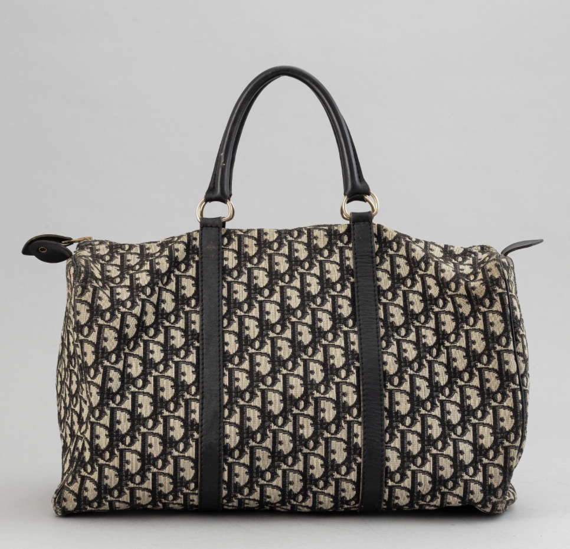

m4_include(../../../setup.m4)

# Lecture 27 - Anti-Counterfeiting Blockchain Example

An Anti-Counterfeiting blockchain based solution is an excellent use-case for
blockchain.

1. Attestation of authenticity.
2. Proof of ownership - so that you can have a legitimate secondary market.
3. Transfer of ownership.

## How big a problem is counterfeiting

1. Counterfeit Drugs.  FDA - $16 billion a year in the US alone.  "From an economic impact perspective, and based on U.S. firms’ share of global revenues, the U.S.
biopharmaceutical industry is annually losing between $37.6 billion and $162.1 billion in revenues" - as repoted by the _medicon_ gorup for the National Institutes of Health.  This also has a knock-on effect, estimated at 6 new drugs not brought to market (it costs 2.6 billion per new drug), 57,000 jobs lost, and 1000's of deaths per year.   The report states, "While difficult to quantify,
studies that have attempted
to measure this large illegal
market estimate that total
global sales are between
$200 billion and $431
billion annually"
2. Counterfeit Car parts.  NTSB - $23 billion a year.   NTSB's comment is that "counterfeit air bags are more likely to kill you than save you."  This will rise because on e of the key ingredients in a catalytic converter is Palladium -and- 42% of that is from Russia.
3. Adidas / Nike think that $500 million in counterfeit shoes a year.
3. Luxury goods.  Billions a year.
4. Total size of counterfeit product market. - Harvard Business Review - "The total trade in fakes is estimated at around $4.5 trillion, and fake luxury merchandise accounts for 60% to 70% of that amount, ahead of pharmaceuticals and entertainment products and representing perhaps a quarter of the estimated $1.2 trillion total trade in luxury goods.  Digital plays a big role in this and perhaps 40% of the sales in luxury fakes take place online, as today’s counterfeiters milk the ubiquity and anonymity of the internet space to the last drop. For every e-commerce platform like Alibaba that cracks down on fakes, a new one emerges that allows goods to be shipped directly from manufacturers."

## Near Field Communications "Chips" - how they work

### Passive NFC

Passive NFC is the ability to read a "code" from a NFC chip.  This is an ID or
a URL containing an ID.

### Active NFC

Active NFC involves a NFC chip that has a computer that generates a set of data
that changes - this can be much more secure.

Active means that the NFC chip either has to have a battery - that will run out
or use the NFC power to do whatever it is going to do.

## How a system could work.

### Use Blockchain to Initialize the IoT chip.

When the manufacturer assigns the chip use a blockchain singed
request to get the "seed" value for future cryptographic random
values.
 

### Only respond to "write" requests.

When a read request with a constant value.

### Only respond to "signed" write requests

When you get a write request validate that it is "signed" by the 
legitimate author of the original chip data.

### Send back a encrypted response

Use a public/private key of the destination to encrypt the response.
This prevents the middleman from being able to alter or interpret 
the response.

### The server (Blockchain Network) can validate the response.

The server can now use it's private key to both validate and decrypt the message.
The message can now be looked up to validate the owner and what the product is.

This can be validated with the "private" key matched to the signature of the
data and checked that this is a valid "owner" on the chain.

This essentially attaches a NFT to a physical product.

### Protect the Privacy on-chain of "ownership" data.

The map from the "owner" to the set of "products" has to keep the set of products
that the owner has a secret.  Use a HMAC with a derived key to find the Products.

### Respond with what the "product" should be.

Send back the "product" with its unique characteristics (human visible ID, Pictures,
description).

For things like a vehicle: the VIN.

