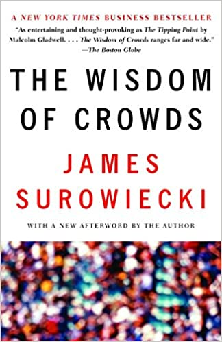

m4_include(../../../setup.m4)

# Lecture 29 - Distributed Autonomous Organizations (DAO) and Proxy Contracts 

## What is a DAO?

A DAO (Decentralized Autonomous Organization) as an organization represented by rules encoded as a transparent computer
program, controlled by the organization members, and not influenced by a centralized control structure. 
As the rules are embedded into the code, no managers are needed, thus removing any bureaucracy or hierarchy hurdles.

Paul Grahm, founder of Ycombinator, figures that getting rid of the "pointy haired" manager improves productivity by a 2 to 4x factor.

Wyoming has "enshrined" this into law...

The Wyoming DAO Law: [https://www.wyoleg.gov/Legislation/2021/SF0038](https://www.wyoleg.gov/Legislation/2021/SF0038)

This is similar to another Wyoming invention, the Limited Liability Corporation (LLC).

DAO's do not obligate you from any of the requirements of a corporation or LLC.  They do provide a new
way to "manage" an organization.

Some existing organizations have gotten rid of helical management.  Zappos for example - fired all it's managers
and "teams" just make decisions on how and what they are going to work on. 

Lot's of stuff is "organized" in different ways.  This is a new form of organization.

Some of the reason for a DAO is the wisdom of the crowd.    

Why/How wisdom of the crowd works....

<div class="pagebreak"></div>

Most of this is from [https://www.amazon.com/Wisdom-Crowds-James-Surowiecki/dp/0385721706/ref=sr_1_1?crid=267JDRKCNTR2J&keywords=Surowiecki&qid=1649072078&sprefix=surowiecki+%2Caps%2C131&sr=8-1](https://www.amazon.com/Wisdom-Crowds-James-Surowiecki/dp/0385721706/ref=sr_1_1?crid=267JDRKCNTR2J&keywords=Surowiecki&qid=1649072078&sprefix=surowiecki+%2Caps%2C131&sr=8-1)



Oinas-Kukkonen in [A. Koohang et al. (Eds): Knowledge Management: Theoretical Foundation. Informing Science Press, Santa Rosa, CA, US, pp. 173-189.](todo)
captures the wisdom of crowds approach with the following eight conjectures:

1. It is possible to describe how people in a group think as a whole.
2. In some cases, groups are remarkably intelligent and are often smarter than the smartest people in them.
3. The three conditions for a group to be intelligent are diversity, independence, and decentralization.
4. The best decisions are a product of disagreement and contest.
5. Too much communication can make the group as a whole less intelligent.
6. Information aggregation functionality is needed.
7. The right information needs to be delivered to the right people in the right place, at the right time, and in the right way.
8. There is no need to chase the expert.

As created in Wyoming the DAO is a "staked" democracy.  

SF0038 (the Wyoming DAO law) has 2 flavors - the human voting flavor and the "autonomous" system.

Note that "diversity, independence, and decentralization" are critical factors.    This is a general
management principal.   You make better decisions when the "team" is diversified.  You get better code
out of "independent" workers.   You get more productivity out of decentralized teams.


## Prediction markets

The most common application is the prediction market, a speculative or betting market created to make verifiable predictions.
Betfair traded $28 billion last year.   To create a good perdition market the "members" have to have a financial stake in the
outcome.   It is not "Who do you think will win the 2024 election" it is "Who will you vote for - with $$ in result."

Betfair has a better than 80% prediction accuracy on elections.

This is the system of "wisdom of the crowds" that underpins risk forecasts for insurance.   

The principle of the prediction market is also used in project management software to let team members predict a project's "real" deadline and budget for a project.


## problems with wisdom of the crowd

Examples:

1. stock market bubbles
2. things like the Challenger Disaster
3. personality cults
4. disinformation

## problems with DAO (human managed)

1. What to vote on needs to be delivered, explained and understood. (6, 7 above)
1. Voting Actually Taking Place - Members must participate
2. Voters voting according to the Wyoming DAO law - tracking / vote-taking is a process
3. Votes are recorded - you would think this is easy - it is not.


## Technical Requirements

From SF0038: "An algorithmically managed decentralized autonomous organization may only form under this chapter if the underlying
smart contracts are able to be updated, modified or otherwise upgraded."


So... How do you upgrade a smart contract...

Just a regular contract is forever - once it is written with a transaction to the chain this is immutable data.

The answer is a thing called a "Proxy" contract.  The Proxy is a contract that is the front end and receives
the calls - then uses the address of a destination contract and passes the calls on to this other contract.
The owner of the proxy can point it at any contract.  


## The Voting Contract

```
m4_include(eth/contracts/DaoVoterContractUpgradableV1.sol.nu)
```

## The Proxy

```
m4_include(eth/contracts/DaoVoterContract.sol.nu)
```


## What is in the "Proxy.sol"

```
m4_include(eth/node_modules/@openzeppelin/contracts/proxy/Proxy.sol.nu)
```

