m4_include(../../../setup.m4)

# Lecture 30 - Games and other stuff

## CryptoKitties (ERC 721) game

CryptoKitties was the first "game" built for Ethereum.

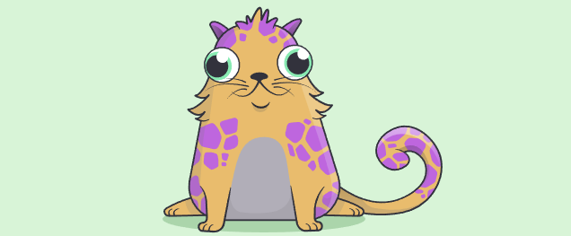

The project raised $12 million in VC and over $50 million in
digital cats have been sold.  The most expensive cat sold for
over $100,000.

Hot it works...

You can buy a cat or a set of cats.   Cats can be bread together.
Each cat has is a NFT with a "hash" code.  Breading the cats
genetically mixes the "hash" code to produce a new cat.   The 
more rare characteristics of the cat the more valuable it is.

Yes I own 2 cryptokitties that are worth basically nothing.

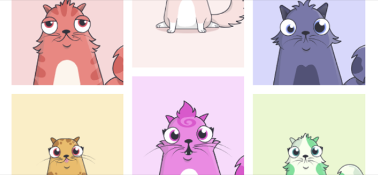

CryptoKitties revealed 2 things about Ethereum...

1. The network would saturate at about 15 TPS
2. Latency is an absolute killer

CryptoKitties is a purely distributed web3.js app.  The images
of the cats are generated and stored in IPFS a distributed
file store.

Each time you take 2 cats and bread them to produce a new cat
the CryptoKitties ERC-721 contract gets a fee.   Every time you
sell a cat it gets a fee.  The number of cats is limited 
making them a collectible.

The first CryptoKitty—the “genesis cats“—were born on December 2, 2017.
Since then, a new “generation 0” cat has been born (popped into existence/minted etc.) on a 15 minute schedule.
The last of the "minted" cats happened 1 year after the start of the game.
Now all new kitties are produced through breeding.

You can “breed” two different CryptoKitties together to get a new CryptoKitty.
Breeding can be with any pair of cats because the don't have a biological sex.
The owners of the cats just have to agree as to which cat is the "dame" and the "sire".
The "dame" keeps the offspring.  The Choice of "dame"/"sire" is not permanent - so you
can reverse this in a later breeding or in future encounters.   There is a small
random component involved in the genetic outcome.

All of this is in smart contracts on Ethereum.  You pay in Eth to make it happen.

## How IPFS works 

IPFS the Interplanetary File Store is a P2P network based file store.  A file is stored based on its Merkle hash
of the contents of the file.

So you:

```
	ipfs add -r ./my-dir
	QmQac2chFyJ24yfG2Dfuqg1P5gipLcgUDuiuYkQ5ExwGap
	my-dir/my-file.txt
```

```
	https://ipfs.io/v1/QmQac2chFyJ24yfG2Dfuqg1P5gipLcgUDuiuYkQ5ExwGap/my-dir/my-file.txt
```

then to get back the file you need the hash

```
	ipfs object get QmQac2chFyJ24yfG2Dfuqg1P5gipLcgUDuiuYkQ5ExwGap
```


## How Amazon S3 works / Amazon Glacier

ZFS based file store.

Backblaze - offers S3 compatible storage for 1/10th the cost.


## Distributed file store

Example: [https://storej.io](https://storej.io) reliable cloud storage.

Example: [https://www.arweave.org/](https://www.arweave.org/) - Claims permanent storage.

Perception is as important as reality.


## Virtual Economics

What is "real".

Games and "virtual" items - just as real - as economically important as a desk.

Eve Online.

D&D / GURPS etc.  Virtual worlds.


## Axie Infinity 

[A hacker stole $625 million from the blockchain behind NFT game Axie Infinity](https://www.theverge.com/2022/3/29/23001620/sky-mavis-axie-infinity-ronin-blockchain-validation-defi-hack-nft)

You have to have $625 million for somebody to steal $625 million.

173,600 Ethereum.

Loosely based on Pokémon, the Axie Infinity game has grown immensely. It uses a play-to-earn model.
It is worth billions.

The largest (and in my onion the best) of all the blockchain based games is Axie Infinity.
It has taken the concept of NFTs (ERC-721) farther than any other game.
The world is populated by Axies (virtual digital creatures) each matched with a NFT.
You have to buy 3 of them to play -they- are not that cheep.  Players can buy, exchange, bread and use them in play.
There are tournaments with them.   A plot of virtual land in the game sold for over $1.5 million dollars.
The tokens in the game are Smooth Love Potion (SLP) and Axie Infinity Shard (AXS).
The game encourages exchange between tokens and outside dollars and is traded
on the exchanges.


AXS is a NFT.

SLP is a ERC-20 based token used in the game.

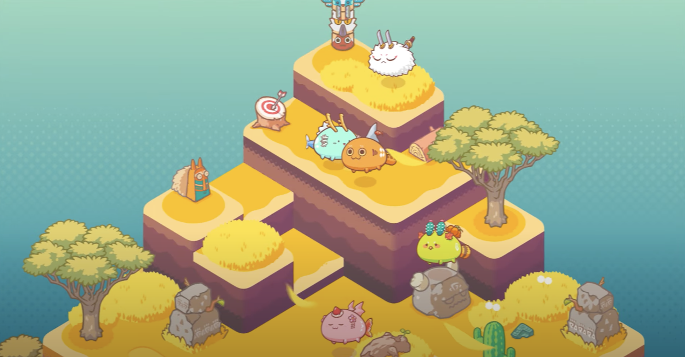


## Other Games

1. Blankos Block Party
2. Upland


## Yield Curve Inverted

An inverted yield curve happens when short-term interest rates become higher than long-term rates.

Let's compare 10-year T-Bills and 30-day T-Bills.  This is the stuff that finances our government debt.

The yield curve recently inverted.  
This is important because of the financially unnatural state that it indicates.  Normally the longer you
wait the more risk there is.   This is saying that there is more risk in the short term than in the long
term.

Why would an investor buy a 10-yr bond when she could get a higher interest rate with a 30-day T-Bill?
It makes no sense from a practical standpoint. Is the short-term rate too high, or is the long-term rate too low? 

Curve inversions may be unnatural, but they happen, and it's happening right now, as in 2 days ago.

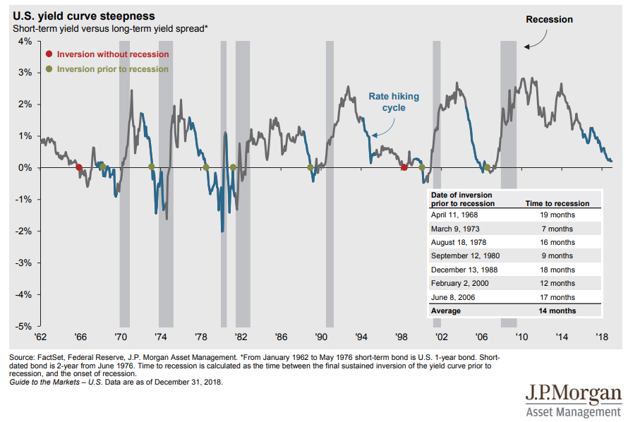


Some Examples

The Global Financial crash of 2008:

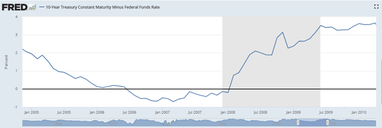

The .com crash of 2000:

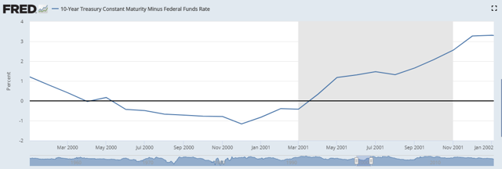

The "Black Tuesday Crash" of 1987.  This is my favorite.  I made money with my first stocks during
this crash.

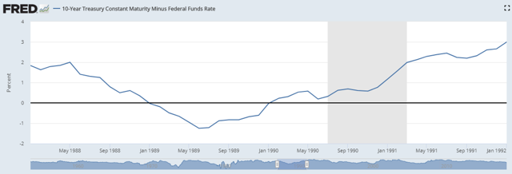

The "stagflation" economy, 1980:

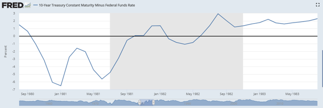

The OPEC oil crisis:

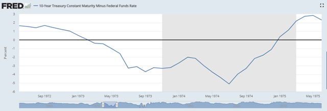

The 1969-1970 recession - mild recession that lasted and lasted.

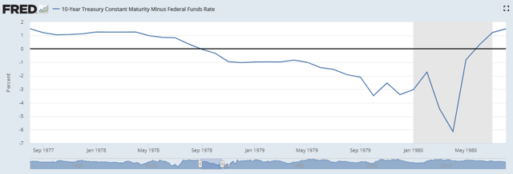 

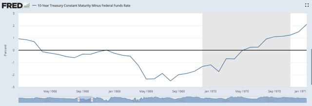
