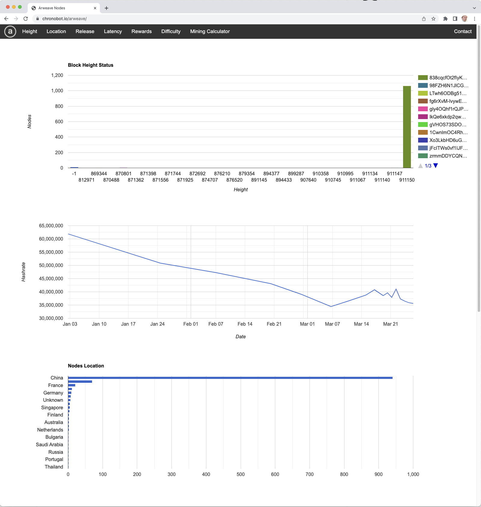
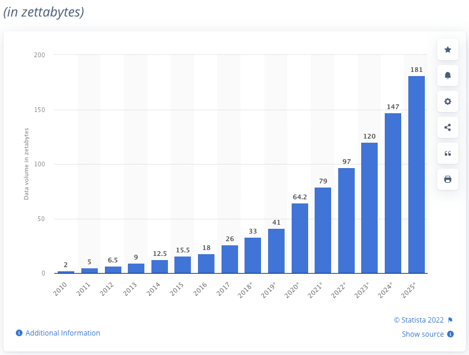
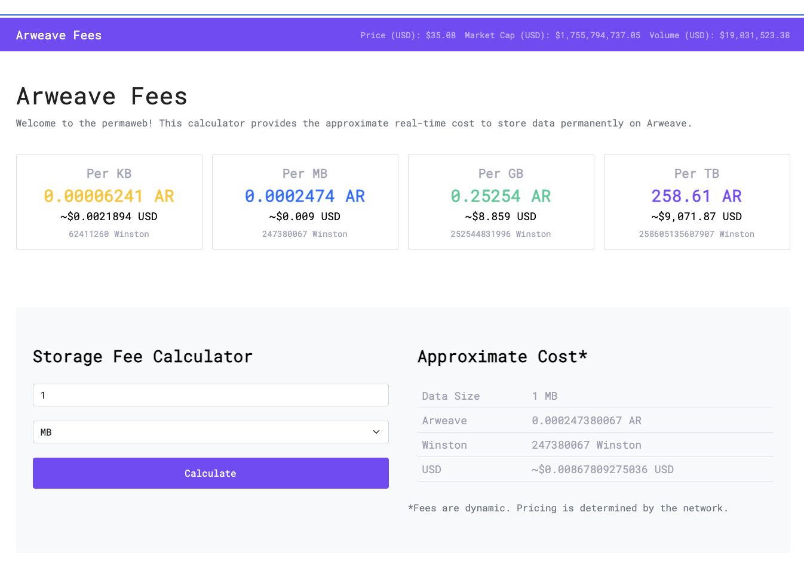

# Consensus based on storage instead of PoS / PoW / PoA.

## Consensus algorithms

We are going to take a closer look at "consensus" protocols.   This is the heart of most of
blockchain technology.   Paxos (Leslie Lamport 1980) is the most common non-blockchain
consensus system.    It is a synchronous protocol with a threshold of n > f+1 where n is the
number of nodes that agree has to be larger than the number of failed nodes.   It is the
heart of Google's F1 database.

Lamport's 1982 paper introduced the term "Byzantine Fault Tolerance" or BFT but did not 
provide a piratical way to implement int.  The paper by Castro, Miguel; Liskov, Barbara (1999)
has the implementation details that are underlay Bitcoin and most proof of work systems.

## Proof of Work Problems

1. It is slow.  Bitcoin takes 10 minutes to sign a block, 1 hour to "accept" a block.
2. It is an arbitrage between the cost of electricity and the reward of mining.  Bitcoin PoW is an environmental disaster.
3. It is not a "proven" protocol.  Oratorios (IO Global/Cardno protocol) is PoS and runs in 8 seconds.   
4. It is really only applicable to gain consensus on small-fixed-set of data.

The most common use of blockchain is "data-sharing":

## Arweave
 
A novel proof of access algorithm is at the heart of Arweave - a storage based blockchain.

From the Arweave site:

<blockquote>

What is Arweave?   &nbsp;  

“Who controls the past controls the future: who controls the present controls the past.”    &nbsp;  

The original vision for the internet was a platform to communicate
freely. As the power of what we created was realised it became a
place where people could be monitored, controlled, and censored.   &nbsp;  

Censorship will soon be a forgotten word.   &nbsp;  

To fight against the direction in which the internet has been taken
we’ve created a truly tyranny- and censorship-free new data storage
protocol on a blockchain-like structure called the blockweave. The
blockweave is based on a novel proof of access consensus mechanism
that makes truly permanent, low-cost data storage available for the
first time.

</blockquote>

I applaud the sentiment - but question the implementation in some ways.

<!--

https://chronobot.io/arweave/

-->

Growth in Data Storage

For storage cost

Virtually all data storage is centralized today.  Amazon S3 is a prime example.  They provide redundancy - but if AWS decides to block you
you are done.  If they corrupt your data you are done.  Essentially we have turned over the distributed world to a set of centralized
operations and these operations (usually non-governmental) are the censors of information and behavior.

Socially unpopular activities get censored.  OnlyFans has difficulty getting credit card companies to
accept it's transactions because "porn is bad".  Guns also fall into this category.

## Innovation!

Collectively this is a really interesting protocol because it relies more on "game theory" than it 
relies on math.   The other extreme of protocols is Honey Badger - that is purely relying on
cryptography. 

## Proof of Storage / Proof of Access

StorJ and others have a proof of access that is based on keeping the entire chain available.  The chain contains all the data
and all the blocks.   Essentially in any round you are asked to provide a hash of the current set of blocks that summarizes
all the blocks (think Merkle Hash tree).

Arweave realized that it is un-realistic to expect that you can keep "all" the data and that what is really needed is good
level of replication of any data object.  So if you have a random subset of the data then you have a probability  of being
able to answer a hash of any set of blocks.  You likelihood of a correct answer is determined by the have / total blocks
so you are more likely to get a rewired if you store more.  This is essentially a proof of stake - where you are staking
the storage of the blocks.  

Also Arweave analyzes the "cost of storage" over time and concludes that the ability to grow the storage at the same
cost will grow the size of the block storage faster than the economic inflation rate of the chain.

## Wildfire

Wildfire is the P2P network protocol optimization that is used in Arweave.

### Sharing is good

Each time you share data with a friend in the Arweave network you benefit.  Each time they share back they
benefit - so you get positive rewards from sharing.   The data is tagged with hashes that allow you to verify
the accuracy of the data at each step.

### Only a Subset of Nodes

One of the problems in communication with blockchain / Ethereum and most other systems is that a node has to
communicate with "all" the other nodes.   This is a huge part of the 22 seconds in Ethereums communication time. 
It takes time for 10,000 computers to all share data.

Arweave uses a reliability score for each node that is saved by each node.  The node only communicates with a
subset of nodes that store-and-forward the information.  New nodes are regularly introduced and then watched
to test reliability.  Periodically the set of "friendly" nodes is pruned to remove bad nodes.   Randomly
nodes will be added back back into the list that are not there.    This produces a weighted graph of communication
that is a subset of all the nodes.

Because each node is in a race to get the "reward" and because communication takes both bandwidth and time it is
to the advantage of the node to keep this list short.   Because each node benefits from successfully sharing
data - it makes it more likely to get a reward - each node is incentivized to keep as many reliable partners
in the list as possible.    This is the core "game theory" that drives most of the choices for Arweave.
The nodes have a optimization algorithm that is really a machine learning / tuning process to keep a
set of reliable partners.

The Berkeley Blockchain Group has published a formal proof that you get the same level of security from 9 random
nodes as you do from a larger chain.  So there is good reason to believe that subset provides the same
security grantees.

## Blockshadows

Transferring large files so as to be able to hash them is slow and expensive.   To address this Arweave introduced
the idea of blockshadows - these are a Merkle hash and a set of hashes that describe the blocks in the file.  It is
essentially the same as a "magnet" link in bittorent.  Instead of using all of a file you use the "torrent" data
as the source of truth for accessibility of a file.   This is proof that you can get the file from the other
nodes.   

