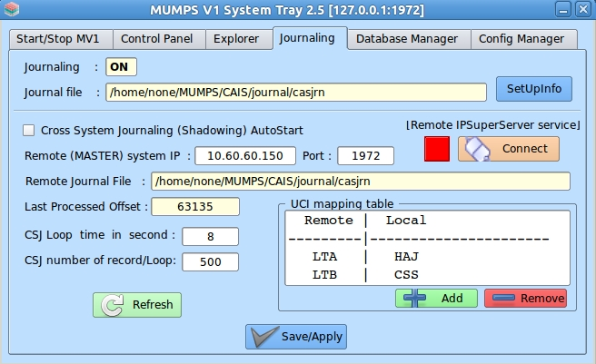

# Lecture 38 -

It really is valuable to have a Proxy and be able to update your contracts.

I bet they wish that they had used a "proxy" so that they could "fix"
any errors.

## Why use a blockchain at all...

1. Shared Data
2. Attestation
3. Finance
4. Distribution of data
5. Prevent "cheating" on data

## How a Medical Records blockchain system works

Reasons to do this

1. State of Health Care in US
2. Data Islands are Bad
3. Inaccuracy of data kills people
1. Virtually nobody keeps records that move with the patient
2. Data sharing is against the self interest of the medial vendor's

Problems to Address

1. HIPAA compliance
2. CCPA - California Privacy Act ( Utah, Colorado, Virginia and others... )
3. Large Data
4. Security

Opportunity

1. 17% of US economy is burnt up in judicial care.
2. medical "really" needs fixing.  
	- US Cost $10,673    per person per year - 78.3		
	- France $5,154      per person per year - 82.8
	- Turkey $2,948      per person per year - 78.3
	- Chile $2,126       per person per year - 78.2
	- Germany $6,224     per person per year - 81.0
	- Switzerland $7,280 per person per year - 83.4
	- Mexico $1,145      per person per year - 77.9

## Now Reality

This is the why do software projects fail category.

1. Lack of team building.
2. Lack of $ for the task at hand.
3. Lack of understanding of the problem.

Look at what is available for medical records now.

Mumps - open source system.

Will medical records fix the problem?

