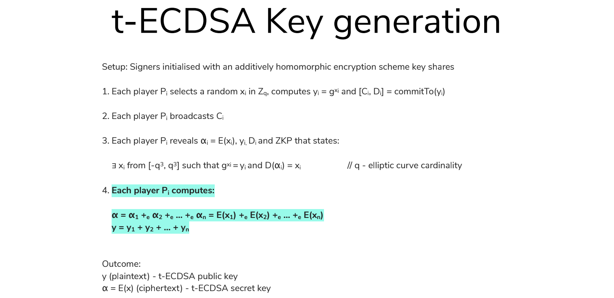

# Lecture 39 - Honey Badger Byzantine

Lecture 39 and 40 - Wednesday and Friday

## Plan for Rest of Semester

No class on Friday May 6 (Last Day of School)

All homework really must be turned in by the final 10:00am May 13.

Office hours by appointment only during finals week.

My Permanent Contact Information.

Philip Schlump  
philip.schlump@protonmail.com  
@pschlump on twitter  
720-209-7888  

## News

1. 16% of americans hold some sort of crypto "coin"
[https://www.pewresearch.org/fact-tank/2021/11/11/16-of-americans-say-they-have-ever-invested-in-traded-or-used-cryptocurrency/](https://www.pewresearch.org/fact-tank/2021/11/11/16-of-americans-say-they-have-ever-invested-in-traded-or-used-cryptocurrency/)

## Implementations

- [go https://github.com/pschlump/hbbft](https://github.com/pschlump/hbbft)
my copy or [Original https://github.com/anthdm/hbbft](https://github.com/anthdm/hbbft)
- [Rust https://github.com/helium/erlang-hbbft](https://github.com/poanetwork/hbbft)
- [Erlang https://github.com/helium/erlang-hbbft](https://github.com/helium/erlang-hbbft)
- [Python https://github.com/initc3/HoneyBadgerBFT-Python/](https://github.com/initc3/HoneyBadgerBFT-Python/)

## References

- [The Honey Badger BFT protocols](https://eprint.iacr.org/2016/199.pdf)
- [Practical Byzantine Fault Tolerance](http://pmg.csail.mit.edu/papers/osdi99.pdf)
- [Treshold encryption](https://en.wikipedia.org/wiki/Threshold_cryptosystem)
- [Shared secret](https://en.wikipedia.org/wiki/Shared_secret)

## Overview - How it works at a high level

Threshold ECDSA overview.

## Details of t-ECDSA

### Additively Homomorphic Encryption

Additively homomorphic encryption has a nice feature, allowing to operate on ciphertexts. One example of additively
homomorphic encryption scheme is Pailier, for which there exists an efficiently computable operation “add”, so
addition operation, that’s plus with e subindex on the slide, that allows to add two ciphertexts together.

So, we can have two values, a and b. We can first encrypt those values and then, using this special operation, add those
two ciphertexts together. Or we can first, having those two values, add them together and then encrypt the result. When
we decrypt we will get exactly the same value in both cases.

[https://en.wikipedia.org/wiki/Paillier_cryptosystem](https://en.wikipedia.org/wiki/Paillier_cryptosystem)

### Threshold Encryption

(t, n) threshold encryption. The easiest way to explain it is to say that we have n players; each one has the same
public key, but also each player has its unique share of the secret key. So, on this slide we have secret_share 1,
secret_share 2, secret_share 3…secret_share n, and signers — if you have a message encrypted under the public
key, signers must cooperate using a special communication protocol that does not expose the secret key in order to
decrypt it.

### Commitment Scheme

Let's say that Alice and Caroline are playing a coin flipping game. Alice chooses the side of the coin, evaluates a
commitment to her choice, and sends the commitments to Caroline. Now Caroline throws the coin into the air and says what
the result is. Next, Alice sends a special value called decommitment key, which allows Caroline to evaluate the
commitment and to see if the value that was initially chosen by Alice is really what she’s saying now.

The decommitment key allows to validate the commitment, but also has a nice feature, allowing to define unconditionally
hiding schemes. So, no matter what Caroline does, no matter how high computing power she has, she cannot guess the value
Alice committed to without having the decommitment key. She cannot do it from just the commitment.

### Key Generation First

Assume we have n signers, each signer is initialized with the additively homomorphic threshold encryption scheme, and
this happens in the setup phase:

This is from [ Threshold-optimal DSA/ECDSA signatures and  
an application to Bitcoin wallet security  
Rosario Gennaro, Steven Goldfeder, and Arvind Narayanan https://eprint.iacr.org/2016/013.pdf](https://eprint.iacr.org/2016/013.pdf)
The paper is 42 pages long.

We have two types of keys. We have threshold additively homomorphic encryption scheme keys which are initialized in the
set-up phase and we also have t-ECDSA key that we use for signing. And this second key is what we are going to generate
now. For the additively homomorphic threshold encryption scheme, we just assume that it’s done in the set-up phase.

Key Generation it’s easy, because we can use a zero-knowledge proof and the commitnment to detect if one party misbehaves.
If you have a bad party then replace them.

Use a trusted dealer that generates a set of keys, distributes them, then forgets them.
Or execute some kind of a dealerless protocol in order to execute the keys by all group members together. 
See [https://link.springer.com/chapter/10.1007/978-3-642-17955-6_4](https://link.springer.com/chapter/10.1007/978-3-642-17955-6_4)

### Key Generation : Choose a random 'x'

In the first step, each player chooses a random integer x, which will be used as a secret key share of that player:

`x` cannot be greater than `q`. `q` is the elliptic curve cardinality, so it’s the number of points elliptic curve
has. On all of the slides, `q` stands for the cardinality of the elliptic curve. Each player computes `y` as `g` to the
power of `x`. This is an elliptic curve operation, and basically, we multiply curve’s generator point by `x`. This is
a notation you will often find for groups, but since elliptic curve is a group we can use it also here.

### Key Generation : Generate Commitments and Broadcast

Then, each player computes a commitment to this value, and in the second round, publishes this commitment to all of the
players in the group:

### Key Generation: Reveal encrypted 'x'

Each player reveals `x` in an encrypted form, it’s `α` (alpha) below:

Encryption is done with the additively homomorphic encryption scheme we initialized in the set-up phase. What’s more,
each player reveals the public key share, the decommitment key, and the zero-knowledge proof stating that all those
values together make sense. This allows for a validation of the commitment, but also allows all players to see if all
those shares that the player just revealed together makes some sense.

So, the zero-knowledge proof says that there exists a number `x` such that curve’s generator point multiplied by `x`
gives point `y`, and `y` is public at this moment because it was just revealed, and that if we decrypt the value α that
we have just published — it’s the encrypted secret key — we’ll get that number `x`.

Of course, it’s a zero-knowledge proof, so it is not possible to guess what `x` really is, but what we say here is
that it lies in the range from (-q³, q³) , and since `q` is the cardinality of the elliptic curve, this range is
really huge.

### Key Generation: Generate ECDSA final key

All signers use the add operation of the additively homomorphic threshold scheme to produce the final t-ECDSA key, so
all of the encrypted shares of x can be added:

We get the secret key in an encrypted form, all revealed public shares of y can be added, and as a result, we have the
public key. Addition operation here is just addition of elliptic curve points, so it’s easy.

## Signature

### Signature: Step 1 and 2

We have `α`, which is a t-ECDSA private key in encrypted form shared between all the signers, and we have `y` which is
a t-ECDSA public key. Public keys are just a point on the elliptic curve.

In the first round each party draws a random integer `ρ`:

Encrypt the value with additively homomorphic threshold encryption scheme:

Multiply the secret ECDSA key (`α` below) by this random value:

Use addition to implement multiplication. Each signer publishes commitment to those values, and in the second round
reveals all those values, along with the zero-knowledge proof, stating that they make sense:

Using zero-knowledge proof and the commitment we can now prove that the values we have are correct.

Join all the shares together (This means broadcast all the shares so that everybody has them):

Reveal the commitments:

### Signature: Step 3 and 4

The same commit-reveal pattern is used in the 3rd and 4th round:

On the right side we have all the parameters that were evaluated so far, and all players have the same values.

In the third round each party draws a random integer `kᵢ`:

And a random integer `cᵢ`:

`q` all the time stands for the cardinality of the elliptic curve, so the number of points on the elliptic curve.

Each party computes `rᵢ` as `g` to the power of `k` — we basically multiply curve generator point by it:

Each party computes the parameter `w` which is `k` time `ρ` plus `c` times `q`:

`q` all the time is the cardinality of the elliptic curve, and we can compute it because we use additively homomorphic
threshold encryption.

At the end, each party commits to all those parameters, and in the round 4 generated parameters are revealed, along with
the zero-knowledge proof stating that they make sense together:

Having all those parameters from all the group members we can add them together, just like we did after the round 2. We
sum up all `k` shares, all `c` shares, all `w` shares.  We evaluate parameter `r` as a sum of all `rᵢ` shares and
we use a special hash function:

This is the standard ECDSA.  `x` is a point coordinate modulo the `q` elliptic curve order.

### Signature: Step 5

All parameters on the right side are shared by all signers in the group. 

Now we need to do some discrete mathematics magic to produce a signature.
Using all those parameters we have evaluated so far, and since we operate on encrypted data, the signature will be also
encrypted.  But this is something we will deal in the final round 6.

The very first thing we need to do is that we execute a threshold decryption mechanism to have all the players decrypt
the parameter `w` and assign this value to `η`:

Compute yet one parameter called `Ψ` which is multiplicative inverse of `η` modulo `q`, and `q` is all the time
cardinality of the elliptic curve:

Having `m`, the hash of the message we are signing (or a hash of the transaction), we start evaluating the signature
with the following equation:

`c` is the value we have just evaluated, and `u`, `r` and `v` are the parameters jointly evaluated by all the signers in
previous rounds.

So, since `u` is an encrypted `ρ`, and `v` is an encrypted `ρ` multiplied by the secret ECDSA key, we can do the
following transformation:

Replace `Ψ` with the value it represents, we will get the following equation:

Eliminate ρ, we get this:

This is the equation is for the standard ECDSA signature, where `k` is the cryptographically secure random integer,
`n` is the message hash, `x` is our secret ECDSA key, and `r` is the curve generated point multiplied `k` times modulo
`q`. 

All those equations were done on ciphertexts, so at the end our signature is also encrypted:

### Signature: Step 6 - Deal with encrypted results

All the players execute a threshold decryption mechanism to learn the value of `s`. And the decrypted value `s` and
parameter `r` evaluated in round 4 together make the signature:

